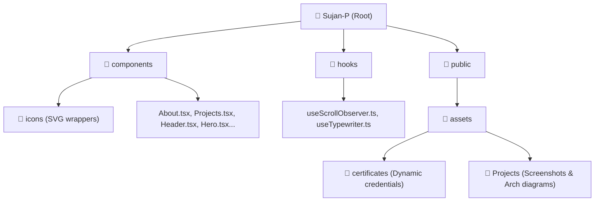

# Sujan P – Portfolio Technical Design & Architecture Report

This report provides a comprehensive guide to the engineering architecture of your personal portfolio application. It details the **"Swiss Brutalist Glassmorphism" hybrid design system, CSS variables, 3-layer typography hierarchy, interactive React behaviors, scroll/mouse physics animations, and modular folder structure** matching the high-fidelity UI/UX implementation.

---

## 🗺️ Project Directory Structure

Your project is structured around a highly modular, decoupled component architecture:



### File Hierarchy & Exact Paths

| Directory / File Path | Description | Key Modules |
| :--- | :--- | :--- |
| [`/index.html`](file:///c:/Users/SUJAN/Documents/Portfolio/Sujan-P/index.html) | Root Entry HTML | Defines font pre-connections, imports **Inter Tight, JetBrains Mono, and Playfair Display** from Google Fonts, links CSS entry, and loads Tailwind CDN. Removed redundant runtime `importmap` block for native Vite bundling performance. |
| [`/index.tsx`](file:///c:/Users/SUJAN/Documents/Portfolio/Sujan-P/index.tsx) | React Mount Entry Point | Initializes React root (`createRoot`) and renders `<App />` within `<React.StrictMode>`. |
| [`/index.css`](file:///c:/Users/SUJAN/Documents/Portfolio/Sujan-P/index.css) | Core Design System stylesheet | House of the **theme configuration**, CSS variables, global scrollbars, layout helpers, animations, and typography tokens. Cleaned and optimized to remove redundant font imports, unused classes, and obsolete variables. |
| [`/vercel.json`](file:///c:/Users/SUJAN/Documents/Portfolio/Sujan-P/vercel.json) | Vercel Deployment Configuration | Configures clean URLs and SPA rewrite rules to direct all deep link routes to `index.html` seamlessly. |
| [`/App.tsx`](file:///c:/Users/SUJAN/Documents/Portfolio/Sujan-P/App.tsx) | Core Shell & Controller Component | Initializes smooth scroll (Lenis), calculates mouse vector dynamics (coordinates, velocity, angle), renders the interactive particles, atmospheric floating light orbs, and wraps the section hierarchy. |
| [`/data.ts`](file:///c:/Users/SUJAN/Documents/Portfolio/Sujan-P/data.ts) | Centralized Data Dictionary | Holds details of navigation, education, certifications, and high-fidelity project content (team sizes, databases, results). |
| [`/types.ts`](file:///c:/Users/SUJAN/Documents/Portfolio/Sujan-P/types.ts) | TypeScript Domain Definitions | Declares structured type definitions like `DetailedProjectContent` and allowed `IconType` keys. |
| [`/components/`](file:///c:/Users/SUJAN/Documents/Portfolio/Sujan-P/components/) | Page-Level React Components | House of individual section containers (e.g. `Hero`, `About`, `Education`, `Projects`, `Achievements`, `Contact`, `Footer`). |
| [`/components/icons/`](file:///c:/Users/SUJAN/Documents/Portfolio/Sujan-P/components/icons/) | SVG Icon Library | Houses lightweight, customized icon components (25 custom icons e.g. `CodeIcon`, `GraduationCapIcon`, `HeartIcon`, `DatabaseIcon`). |
| [`/hooks/`](file:///c:/Users/SUJAN/Documents/Portfolio/Sujan-P/hooks/) | State & Physics Side-Effect Hooks | Houses modular custom hooks (`useTypewriter` and `useScrollObserver`) to separate UI updates from logic. |
| [`/public/assets/`](file:///c:/Users/SUJAN/Documents/Portfolio/Sujan-P/public/assets/) | Asset Storage | Contains folders for PDF Resume, credentials (`certificates/`), and high-res case study figures (`Projects/`). Standardized to clean names matching standard web URI paths. |

---

## 🎨 Design Tokens & Custom CSS Properties

Your portfolio implements a bespoke **Swiss Brutalist Glassmorphism System** designed through custom CSS properties defined at the `:root` level of [`/index.css`](file:///c:/Users/SUJAN/Documents/Portfolio/Sujan-P/index.css). Obsolete rules and duplicate font imports were successfully purged to ensure premium performance and fast rendering times.

```css
:root {
    /* 🎨 Color System (Dark Teal Palette) */
    --bg: #000000;
    --surface: #0a0a0a;

    --text-main: #f8fafc;
    --text-muted: #94a3b8;

    --primary: #0f766e;
    --primary-hover: #115e59;
    --primary-soft: rgba(15, 118, 110, 0.08);

    /* Borders (Structured Card Outlines) */
    --border: rgba(255, 255, 255, 0.12);

    /* Glass Brutalist Shadow Matrix */
    --glass-bg: rgba(10, 10, 10, 0.72);
    --glass-bg-soft: rgba(255, 255, 255, 0.04);
    --glass-border: rgba(255, 255, 255, 0.12);
    --card-shadow: 8px 8px 0px rgba(15, 118, 110, 0.18);
    --card-shadow-hover: 12px 12px 0px rgba(15, 118, 110, 0.22);

    /* Spacing System (Swiss Editorial whitespace rhythm) */
    --container-width: 1200px;

    /* 🔵 Radius System (Sharp, Modular Architecture) */
    --radius-global: 8px;
    --radius-pill: 4px;
    --radius-image: 8px;
    --radius-collapse: 8px;

    /* 🔁 Transition System */
    --transition-global: all 200ms cubic-bezier(0.16, 1, 0.3, 1);
    --transition-reveal: 650ms cubic-bezier(0.16, 1, 0.3, 1);
}
```

---

## ✍️ 3-Layer Typography Hierarchy

The UI achieves a structured systems dashboard feeling using a dedicated three-tier typography architecture:

### 1. Primary UI Font: `Inter Tight`
* **Purpose:** Dictates readability for general structure, layout descriptions, body copy, and UI paragraphs.
* **Aesthetics:** Compact, clean, sans-serif character spacing.

### 2. Technical Font: `JetBrains Mono`
* **Purpose:** Used for structural telemetry, modular indices (`[SYS-01]`), labels (`// ROLE`), badges, dates, parameters, and action controls.
* **Aesthetics:** Monospace, strict engineering look, uppercase, high letter-spacing (`tracking-wider`).

### 3. Editorial Font: `Playfair Display Italic`
* **Purpose:** Integrated extremely sparingly for narrative contrast and sophistication (e.g., Hero statement and key overview quotes).
* **Aesthetics:** Classic high-contrast italic serif, introducing luxury context.

---

## 🧱 Modular Brutalist Cards

To evolve beyond standard floating bubbles, cards are structured using a **Tactile Brutalist Grid**:
* **Frame:** `background: rgba(10,10,10,0.72)` paired with `border: 2px solid rgba(255,255,255,0.12)`.
* **Sharp Corners:** Replaced rounded 16px layouts with a structured `border-radius: 8px` outline.
* **Tactile Hard Shadows:** Hard offset solid shadows `8px 8px 0px rgba(15,118,110,0.18)`.
* **Hover Physics:** Evolved scaling animation into a directional translation vector:
  * **Hover Action:** `transform: translate(-4px, -4px)`
  * **Shadow Lift:** `box-shadow: 12px 12px 0px rgba(15,118,110,0.22)`
  This creates a satisfying mechanical, mechanical click response.

---

## ⚡ Section Spacing & Headers

Sections are titled and spaced utilizing the **Swiss Editorial Layout Rhythm**:
* **Divider Headers:** Evolved generic headers into asymmetrical left-aligned modules:
  * Monospace indices: `// SYS-MODULE: SELECTED SYSTEMS`
  * Solid structural timeline divider line: `border-l-4 border-[var(--primary)] pl-6`
  * Large, bold uppercase title hierarchy.
* **Spacing:** Asymmetrical spacing vectors, introducing generous breathing room between sections for a modern, clean, research-control-panel feel.

---

## 🎬 Advanced CSS & Physics Animations

### 1. Vector Spotlight Tracking & Velocity Analytics
* **Location:** Coordination in [`/App.tsx`](file:///c:/Users/SUJAN/Documents/Portfolio/Sujan-P/App.tsx#L53-L96)
* **How it works:** Listens to `mousemove` events, tracking exact coordinates, movement velocity, and direction angle dynamically inside a `requestAnimationFrame` debouncer. Exposes `--x`, `--y`, `--velocity`, and `--angle` CSS variables at the root.

### 2. Interactive Particles Canvas
* **Location:** [`/components/ParticlesBackground.tsx`](file:///c:/Users/SUJAN/Documents/Portfolio/Sujan-P/components/ParticlesBackground.tsx)
* **How it works:** Canvas rendering engine showing 20 slow-drifting teal particles. Parallax offsets are calculated using cursor distances from center, generating immersive depth.

### 3. Atmospheric Floating Light Orbs (Tuned down)
* **Location:** Layout in [`/App.tsx`](file:///c:/Users/SUJAN/Documents/Portfolio/Sujan-P/App.tsx#L102-L108), style mapping in [`/index.css`](file:///c:/Users/SUJAN/Documents/Portfolio/Sujan-P/index.css#L256-L290).
* **How it works:** Four absolute-positioned blurred gradient light orbs (`.floating-orb`). The orb opacity is restricted to `0.08` to create a mature background ambience rather than a glowing fantasy look.

### 4. Case Study Details Modal System (Portals)
* **Location:** [`/components/ProjectDetailsModal.tsx`](file:///c:/Users/SUJAN/Documents/Portfolio/Sujan-P/components/ProjectDetailsModal.tsx)
* **How it works:** Uses `createPortal` to render the case study view into `document.body`, featuring scroll traps (`data-lenis-prevent`), Escape key listeners, page body scroll locking, and isolated technical scrollbars.

---

## 💎 Custom Component Redesigns

### 1. Structured Hero Section
* **Left Column:** Evolved into a bold typographical grid containing monospace parameters, large name titles, technical indicators, and the contrast serif statement: *“Designed with structure. Engineered for impact.”*
* **Right Column:** Layered interactive float windows (IDE with `tamil-ocr.py` code, AutoQuizzer telemetry widget, and MedCard credential) updated to feature brutalist corners, 2px borders, monospace headings, and hard shadows.
* **Layering Order:** Fixed the profile portrait card to render at `z-50`, displaying on top of the other modules for proper focal weight.

### 2. Technical System Project Panels
* Evolved generic project grids into structured technical specifications sheets.
* Each panel includes:
  * Monospace ID: `[AI-01]`, `[SYS-02]`, etc.
  * Uppercase structural bold title.
  * Specification modules divided by clean layouts: **ROLE**, **SYSTEM STACK**, **CAPABILITIES**, and **SYSTEM RESULT**.
  * Action controls rendered in brutalist monospace buttons.

### 3. Capabilities, Milestones, and Telemetries
* **Technical Capabilities:** Restructured skill categories and badges into modular technical grids with JetBrains Mono markers.
* **Achievements & Timeline Education:** Timeline marker points converted to sharp boxes, with timeline cards inheriting the satisfying directional translation hover vectors.
* **Contact Telemetry:** Input fields redesigned into rectangular textareas and boxes, featuring subtle teal borders on focus with a flat brutalist submit control (`TRANSMIT_PACKET.EXE`).
